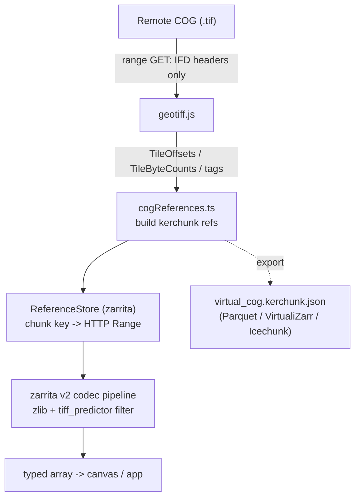

# virtual-cog-pilot

Virtualize a **Cloud Optimized GeoTIFF** as a **Zarr** store *on the fly*, in the
browser, and emit a reusable **kerchunk**-style byte-reference set.

No server, no conversion, no copy of the data: the app reads only the COG's IFD
headers (via HTTP range requests), synthesizes Zarr v2 metadata, and maps each
Zarr chunk directly to a `[url, byteOffset, byteLength]` slice of the original
`.tif`. Those references both drive rendering *and* can be saved and later
converted to kerchunk Parquet, VirtualiZarr, or Icechunk for use elsewhere.

The default dataset is a cloud-free, **projected** (EPSG:32755 / UTM 55S)
Sentinel-2 scene over Tasmania (tile 55GCP), chosen to exercise the hard case:
a tiled, DEFLATE-compressed, horizontally-predicted, overviewed COG on a
projected grid.

## How it works



Key pieces:

| File | Role |
|------|------|
| `src/cogReferences.ts` | Reads IFDs, synthesizes Zarr v2 metadata, builds the kerchunk reference set. |
| `src/tiffPredictor.ts` | A zarrita array-to-array filter that undoes TIFF horizontal differencing (Predictor = 2). |
| `src/VirtualCogStore.ts` | Wraps it all: `init()` → references, a Readable store, and `toKerchunk()`. |
| `src/main.ts` | Browser harness: metadata, a references download button, and a preview render. |

### The predictor detail

TIFF's horizontal predictor is *per row*, which is **not** the same as zarr's
built-in Delta filter (flattened over the whole chunk). So the store declares
`compressor: {id: "zlib"}` plus `filters: [{id: "tiff_predictor"}]` and registers
a small custom codec for the latter. This keeps the references pure byte pointers
and faithful to the ecosystem (the predictor is captured as a normal zarr filter).

## Run it

```sh
npm install
npm run dev        # serves http://localhost:3000
```

Other scripts:

```sh
npm run build        # type-check + production build
npm run validate     # Node: prove the byte-reference round-trip vs geotiff's decode
npm run test:store   # Node: end-to-end refs -> ReferenceStore -> zarrita decode
```

In the browser you can switch datasets:

- `?dataset=sentinel` — the projected Sentinel-2 tile (multiscales layout).
- `?dataset=gebco` — GEBCO 2026, built as a CF/GeoZarr regular lat/lon grid.

Point the Node tools at any CORS-enabled COG:

```sh
node scripts/validate.mjs <cog-url> [level] [tileY] [tileX]
npx tsx scripts/test-store.ts <cog-url>      # multiscales layout
npx tsx scripts/test-gridlook.ts <cog-url>   # GeoZarr (gridlook) layout
```

## Scope

Supported today (pilot): tiled COGs, single band, dtype from TIFF sample format,
**uncompressed** or **DEFLATE** (with predictor 1 or 2), overviews mapped to a
Zarr multiscales group (`0`, `1`, …). Sparse/zero-length tiles are dropped so the
reader falls back to `fill_value`.

Not yet: LZW / JPEG / WEBP / LERC codecs, floating-point predictor (3),
pixel-interleaved multiband (needs `PlanarConfiguration = 2`). These levels are
reported as non-referenceable rather than mis-decoded.

## gridlook

[gridlook](https://github.com/d70-t/gridlook) detects grid type from a data
variable's dimension names and reads 1D `lat`/`lon` coordinate variables. The
**GeoZarr (gridlook) layout** here produces exactly that for a geographic COG:
`elevation` with `_ARRAY_DIMENSIONS = ["lat","lon"]`, synthesized `lat`/`lon`
coordinate arrays (inlined as base64), a `crs` variable, and consolidated
`.zmetadata`. `npm run test:gridlook` asserts gridlook would classify it as a
`REGULAR` grid. The references still point at the original `.tif` for every pixel
tile; only the coordinate arrays are materialized.

Opening it *inside* gridlook needs the references served at a URL (gridlook also
uses zarrita's `ReferenceStore`), or a small code integration — a natural next
step.

### Projected COGs

A projected COG (UTM, Web Mercator, …) does not need pixel reprojection to reach
gridlook. gridlook already turns projected `x`/`y` axes into lon/lat with proj4
(`projectXYGridToLonLat`) and renders them as a **curvilinear** grid. So a future
projected layout can emit `x`/`y` coordinate arrays plus a `crs_wkt`/`spatial_ref`
attribute and let gridlook generate the mesh — no server-side warping, same
on-the-fly byte references.
